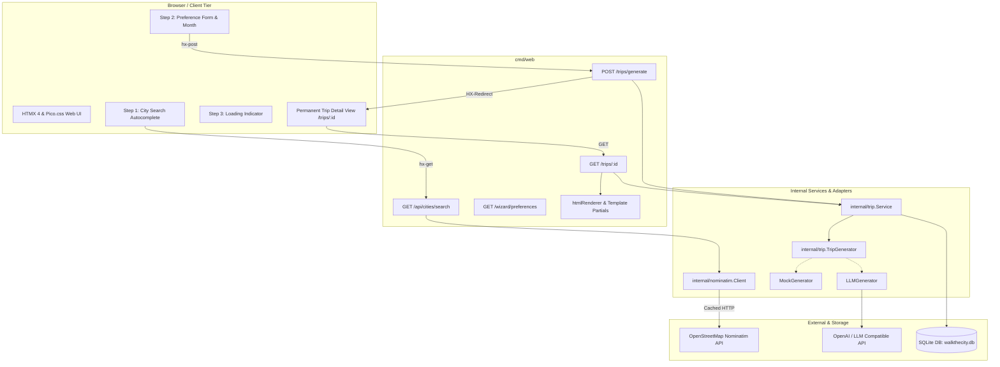

## Goal Capsule

- **Objective:** Enable travelers to easily plan a personalized, rich city trip by searching a city via Nominatim, answering three focused preference questions plus their travel month, and receiving a permanent, shareable hybrid itinerary featuring daily walking/transit routes alongside standardized visual highlight cards.
- **Means:** Implement a multi-step HTMX wizard in the Go web tier (`cmd/web`), proxy OpenStreetMap Nominatim search requests server-side with rate limiting and caching (KTD1), establish a decoupled trip generation service seam in `internal/trip` with structured JSON persistence (KTD2, KTD3), and render responsive Pico.css card components with deep links (KTD5, KTD6).
- **Authority:** Product Contract governs user-facing wizard flows, input constraints, card schemas, and trip output structures; Planning Contract governs architectural decisions, package boundaries, GORM SQLite persistence, and HTMX partial routing.
- **Stop Conditions:** All Go packages compile cleanly with `CGO_ENABLED=0`, automated test suites pass (`go test ./...`), database migrations apply on startup, the multi-step wizard executes smoothly from city lookup to preference selection, and generated trips render at permanent `/trips/{id}` URLs with valid map/wiki deep links.
- **Execution Profile:** Sequential unit implementation ordered by foundational dependencies: Nominatim Client -> Domain & Itinerary Models -> Generator Engine -> Template Helpers & Card Partials -> Wizard Web Handlers -> Trip Detail Page -> E2E Integration & Documentation.

---

## Product Contract

### Summary

The city trip wizard and generator introduces a streamlined two-step planning flow for *walk-the-city*. Travelers search and select a validated city using a server-proxied OpenStreetMap Nominatim search, configure travel month and three key preferences (Duration/Pace, Core Interests, Preferred Mobility) on a single screen, and receive a rich hybrid itinerary. The generated trip combines a structured daily schedule with unified visual cards for architectural highlights, historical stories, cool trivia facts, non-touristic food spots, and direct deep links to OpenStreetMap/Google Maps and Wikipedia.

### Problem Frame

Travelers exploring historic and culturally rich cities are often overwhelmed by sprawling listicles, generic travel blogs, and fragmented map searches. They struggle to find balanced itineraries that blend iconic architectural landmarks and historical narratives with authentic, off-the-beaten-path neighborhood dining and clear transit/walking logistics. Existing tools either produce rigid generic schedules or unstructured lists of attractions without the historical storytelling, local living context, and practical transit guidance needed for an effortless visit.

### Key Decisions

- **Hybrid Itinerary & Highlight Cards Structure:** (session-settled: user-directed — chosen over pure day-by-day itinerary or thematic discovery guide: provides a practical daily schedule while featuring rich standalone cards for stories, trivia, and food spots). Governs R7, R8, R9, R10.
- **Three Standardized Follow-Up Preference Inputs:** (session-settled: user-directed — chosen over custom or open-ended questionnaires: maximizes signal with minimal traveler friction using Pace/Duration, Interests, and Mobility). Governs R4, R5.
- **Multi-Step Wizard Flow:** (session-settled: user-directed — chosen over single-page progressive disclosure: creates a clear, focused transition from city search to preference selection to final itinerary). Governs R1, R2, R3, R4, R6.
- **Rich Actionable Cards with Unified Visual System:** (session-settled: user-directed — chosen over minimalist text links or route-only cards: provides standardized category badges, icons, historical/trivia lore, transit guidance, and external map/wiki links). Governs R8, R9, R11, R12.
- **Permanent Saved Trips with Shareable URL:** (session-settled: user-directed — chosen over session-only generation: saves generated trips to SQLite at `/trips/{id}` for easy bookmarking, revisiting, printing, and sharing). Governs R13, R14.
- **Server-Proxied Nominatim Integration:** The Go backend proxies Nominatim queries with an application-specific `User-Agent` and debouncing/caching, preventing client-side CORS issues and adhering to OpenStreetMap API usage policies. Governs R1, R2.
- **Decoupled Generator Service Seam:** The trip generation engine is structured behind a Go interface returning a typed domain itinerary, keeping HTTP handlers decoupled from generation logic and enabling mock testing in CI. Governs R6, R7, R15.

### Key Flows

- F1. City Search & Selection
  - **Trigger:** Traveler enters a city query on the homepage (Step 1).
  - **Steps:** HTMX queries the server-side Nominatim proxy on input with debounce; the server returns matching city candidates (e.g. "Rome, Lazio, Italy" vs "Rome, GA, USA"); the user selects their destination to advance.
  - **Outcome:** City name and geographic metadata are locked into the wizard session state.
  - **Covers:** R1, R2, R3.

- F2. Preference Configuration
  - **Trigger:** Traveler arrives at the preference screen (Step 2).
  - **Steps:** The user selects the travel month (e.g. September) and answers three pre-defined inputs: Trip Duration & Pace (e.g. 1-4 days, relaxed vs active), Core Interests (e.g. Architecture, History, Local Food & Living, Hidden Spots), and Preferred Mobility (e.g. Walking + Public Transit, Walking Only).
  - **Outcome:** Completed preference payload is validated and submitted via HTMX.
  - **Covers:** R4, R5.

- F3. Trip Generation & Hybrid Output Rendering
  - **Trigger:** Traveler clicks "Generate City Trip" (Step 3).
  - **Steps:** HTMX displays an active generation indicator while the server constructs the prompt, invokes the generation service seam, validates the structured output, persists the trip to SQLite, and returns an `HX-Redirect` or renders the trip page.
  - **Outcome:** Traveler views the comprehensive trip itinerary at `/trips/{id}` with daily route segments and standardized highlight cards.
  - **Covers:** R6, R7, R8, R9, R10, R11, R12, R13.

- F4. Itinerary Revisit & Sharing
  - **Trigger:** Traveler returns to `/trips/{id}` directly via browser bookmark or shared link.
  - **Steps:** The web server retrieves the stored trip and its structured itinerary from SQLite and renders the full trip view without re-generating.
  - **Outcome:** Persistent, shareable, and print-friendly itinerary view is displayed immediately.
  - **Covers:** R13, R14.

### Requirements

#### City Search & Validation
- R1. Nominatim search proxy: Provide a backend endpoint (`GET /api/cities/search`) that forwards queries to `https://nominatim.openstreetmap.org/search` with `format=jsonv2`, `featuretype=city`, and a compliant `User-Agent` header.
- R2. Search debounce & caching: Cache Nominatim responses in-memory or in SQLite by query string and debounce frontend input to respect Nominatim rate limit guidelines (1 request per second).
- R3. City selection UI: Display matching city candidates with city name, administrative region, and country flag/code, allowing the user to select the exact destination.

#### Wizard Flow & Preference Inputs
- R4. Single-view preference form: Render Step 2 containing exactly one travel month selector (January to December) and at most three pre-defined follow-up preference inputs:
  - Duration & Pace (e.g. 1-4 days; Relaxed vs Moderate vs Packed)
  - Core Interests (selectable pills: Architecture, History & Origins, Non-touristy / Local life & Food, Art & Culture, Nature & Parks)
  - Preferred Mobility (Walking + Public Transit, Walking Only, Bicycle, Accessible)
- R5. Preference validation: Require destination, month, duration, and at least one core interest before permitting trip generation, returning inline validation errors (422) if invalid.
- R6. Interactive generation state: Provide a clear loading state with contextual feedback while the trip is being synthesized and persisted.

#### Itinerary Structure & Generation
- R7. Hybrid itinerary structure: Organize each generated trip into a daily chronological schedule (Morning, Afternoon, Evening) paired with standalone highlight modules for deeper exploration.
- R8. Historic & architectural storytelling: Include narrative background vignettes explaining historical events, architects, or cultural shifts that shaped specific buildings and public squares.
- R9. Local food & living recommendations: Include curated, non-touristic neighborhood food recommendations (e.g., authentic bakeries, historic coffee bars, local trattorias) highlighting typical regional specialties.
- R10. "Cool to Know" facts: Include a dedicated trivia and seasonal insights section highlighting surprising cultural quirks, etiquette tips, and weather/seasonal advice tailored to the selected travel month.

#### Unified Visual Cards & External Links
- R11. Unified card component: Render all places, stories, facts, and food stops using a consistent card design featuring:
  - Category badge (e.g., `Architecture`, `History`, `Food & Living`, `Cool Fact`, `Transit`)
  - Thematic icon or thumbnail visual container
  - Title and neighborhood / district tag
  - Concise narrative description or trivia text
  - Estimated walking distance and transit connection guidance
- R12. Actionable external deep links: Provide standardized external links on every place card to OpenStreetMap / Google Maps (directions/location query) and Wikipedia / official cultural reference pages.

#### Persistence & Access
- R13. Permanent SQLite storage: Store generated itineraries in SQLite linked to the trip record, storing structured daily segments, cards, stories, and facts.
- R14. Shareable trip URL: Expose each generated trip under a permanent route `GET /trips/{id}`, rendering the complete itinerary for bookmarking, mobile viewing, and printing.

#### Verification & Reliability
- R15. Decoupled test harness: Implement a mock generation service implementation in Go test suites to verify full end-to-end wizard transitions and template rendering without external network or LLM dependencies.

### Acceptance Examples

- AE1. Nominatim City Search Autocomplete
  - **Trigger:** Traveler enters "Rom" in the city search input on Step 1.
  - **Steps:** Request hits `GET /api/cities/search?q=Rom`; backend returns matching items including "Rome, Roma Capitale, Lazio, Italy" and "Rome, Floyd County, Georgia, United States".
  - **Outcome:** Dropdown lists matching candidates with region and country; clicking Rome (Italy) records city coordinates and advances the wizard to Step 2.
  - **Covers:** R1, R2, R3.

- AE2. Preference Submission Validation
  - **Trigger:** Traveler submits Step 2 with Month = "September", Duration = 3 days, Interests = ["Architecture", "History", "Local Food & Living"], Mobility = "Walking + Public Transit".
  - **Steps:** HTMX posts form to `/trips/generate`; server validates all fields.
  - **Outcome:** Form validation succeeds; server responds with generation loading trigger or direct redirect to `/trips/{id}`.
  - **Covers:** R4, R5, R6.

- AE3. Hybrid Itinerary Output Generation
  - **Trigger:** Traveler loads the generated trip `/trips/{id}` for Rome in September.
  - **Steps:** Server renders the trip page with Day 1, Day 2, and Day 3 daily schedules (Morning / Afternoon / Evening stops) plus thematic highlight sections.
  - **Outcome:** Traveler sees walking routes connecting Colosseum to Monti neighborhood, with transit recommendations (Metro B line) between distant quarters.
  - **Covers:** R7, R8, R9, R10.

- AE4. Rich Actionable Card Rendering
  - **Trigger:** Traveler inspects a food recommendation card in the Trastevere section.
  - **Steps:** Card displays `Food & Living` badge, trattoria name, background note on Roman supplì / cacio e pepe, 8-minute walking distance from previous stop, and links: "Open in Maps" (linking to coordinates) and "Wikipedia: Roman Cuisine".
  - **Outcome:** Card renders with identical typography, padding, and layout as architectural and story cards.
  - **Covers:** R11, R12.

- AE5. Permanent Trip Link Revisit
  - **Trigger:** Traveler opens `/trips/42` in an incognito browser window or days later.
  - **Steps:** Server queries SQLite database for trip ID 42 and renders the full saved itinerary.
  - **Outcome:** The identical trip itinerary, stories, facts, and links are served with HTTP 200 without triggering new generation API calls.
  - **Covers:** R13, R14.

### Scope Boundaries

#### In Scope
- Multi-step HTMX wizard for city search, preference collection, and itinerary presentation.
- Server-side Nominatim API proxy with caching, debouncing, and User-Agent compliance.
- Travel month picker and 3 pre-defined follow-up preference inputs (Duration/Pace, Interests, Mobility).
- Structured hybrid trip generation schema (daily walking routes, architectural/historic stories, cool trivia facts, local non-touristic food spots).
- Unified visual card component system with Pico.css styling and external map/wiki links.
- SQLite persistence of structured itineraries and permanent `/trips/{id}` routes.
- Mock generation service implementation for unit and integration testing.

#### Deferred for Later
- Real-time turn-by-turn in-browser GPS navigation and live geolocation tracking.
- Client-side interactive map canvas rendering (Leaflet / MapLibre).
- User authentication, user profiles, and private trip permissions.
- Direct booking / ticket reservation integrations (flights, hotels, museums).
- Export to PDF / ICS calendar downloads.

#### Outside This Product's Identity
- Full-service commercial travel agency or ticket marketplace.
- Real-time flight tracker or hotel aggregator.
- Social media community feed or public commenting forum.

### Dependencies & Assumptions

- **Nominatim Search Service:** Relies on OpenStreetMap's public Nominatim instance, assuming standard API uptime and adherence to rate limits via server-side caching.
- **LLM Generator Backend:** Assumes an LLM provider (OpenAI API or compatible endpoint) capable of returning structured JSON adhering to the itinerary schema, with a deterministic mock fallback for offline development and testing.
- **Client Requirements:** Modern web browser supporting standard HTMX 4 hypermedia operations and responsive CSS.

---

## Planning Contract

### Key Technical Decisions

- KTD1. **Nominatim Client with In-Memory TTL Cache and Rate Limiting:** (session-settled: user-directed — chosen over direct client-side browser fetch: prevents CORS issues, protects rate limits, and injects compliant User-Agent). Implement `internal/nominatim/client.go` with a thread-safe `sync.RWMutex` in-memory cache with 24-hour TTL and a token bucket rate-limiter ensuring at most 1 request per second to `https://nominatim.openstreetmap.org/search`. Governs R1, R2.
- KTD2. **Hybrid Relational + JSON SQLite Schema for Itineraries:** (session-settled: user-directed — chosen over deep relational normalization: eliminates complex join cascades while keeping core metadata queryable). Extend `Trip` model in `internal/trip/model.go` with relational fields (`City`, `Country`, `Lat`, `Lon`, `Month`, `Pace`, `Interests`, `Mobility`) and a single `ItineraryJSON` text column storing validated JSON deserialized into typed Go domain structs (`Itinerary`, `DayPlan`, `Stop`, `Card`). Governs R7, R8, R9, R10, R13.
- KTD3. **Decoupled Generator Engine with Mock & LLM Providers:** (session-settled: user-approved — chosen over hardcoding an external API client: enables fast offline testing and zero-cost local dev). Define `TripGenerator` interface in `internal/trip/generator.go` with two implementations: `MockGenerator` (returns deterministic, rich city itineraries for offline testing) and `LLMGenerator` (calls OpenAI-compatible structured completion endpoints). Governs R6, R7, R15.
- KTD4. **Multi-Step HTMX Hypermedia State Machine:** (session-settled: user-directed — chosen over client-side SPA state: preserves progressive enhancement and simple Go templating). Route Step 1 (`GET /`), city search results (`GET /api/cities/search`), Step 2 (`GET /wizard/preferences`), and generation submit (`POST /trips/generate`) using HTMX partial swaps into `#wizard-container`, with `HX-Redirect` on completion to permanent `/trips/{id}`. Governs R1, R3, R4, R5, R6.
- KTD5. **Unified Card Component in Pico.css:** (session-settled: user-directed — chosen over divergent card templates: enforces a single design system for places, stories, trivia, and food). Build `assets/html/partials/trip_card.tmpl` with shared grid classes, category pill badges (`Architecture`, `History`, `Food & Living`, `Cool Fact`), lore snippets, and action buttons. Governs R8, R9, R11, R12.
- KTD6. **Map and Wiki Deep-Link Helper Functions:** Register template helper functions `osmSearchURL(query, lat, lon)`, `googleMapsURL(query, lat, lon)`, and `wikiURL(query)` in `cmd/web/html.go` to generate clean, URL-encoded external links. Governs R12.

### High-Level Technical Design



### Output Structure

```text
assets/
  html/
    base.tmpl
    pages/
      home.tmpl
      trip_detail.tmpl
    partials/
      form_errors.tmpl
      step1_city.tmpl
      step2_preferences.tmpl
      generation_loading.tmpl
      trip_card.tmpl
      daily_route.tmpl
      trip_list.tmpl
      trip_row.tmpl
  static/
    css/
      pico.min.css
      custom.css
    js/
      htmx.min.js
cmd/web/
  handlers.go
  handlers_test.go
  html.go
  html_test.go
  main.go
  wizard_integration_test.go
internal/
  config/
    config.go
    config_test.go
  database/
    database.go
  nominatim/
    client.go
    client_test.go
  trip/
    generator.go
    generator_mock.go
    generator_llm.go
    generator_test.go
    model.go
    service.go
    service_test.go
```

---

## Implementation Units

### U1. Nominatim Client & Server-Side Search Proxy
- **Goal:** Create a robust Nominatim API client in `internal/nominatim` with caching and rate limiting, and wire it to a backend search route.
- **Requirements:** R1, R2, R3 (Covers F1, AE1)
- **Dependencies:** None
- **Files:**
  - `internal/nominatim/client.go`
  - `internal/nominatim/client_test.go`
  - `internal/config/config.go`
  - `cmd/web/handlers.go`
  - `assets/html/partials/step1_city.tmpl`
- **Approach:**
  1. Define `SearchResult` struct with `PlaceID`, `DisplayName`, `City`, `State`, `Country`, `CountryCode`, `Lat`, `Lon`.
  2. Implement `Client` with `http.Client`, custom `User-Agent` header (`walk-the-city/1.0 (+https://github.com/havspect/walk-the-city)`), and query parameter construction (`format=jsonv2`, `featuretype=city`, `addressdetails=1`).
  3. Implement in-memory cache with 24-hour expiration for repeated city queries and a rate-limiting throttle (1 req/sec).
  4. Create `app.searchCities` handler in `cmd/web/handlers.go` returning the `step1_city.tmpl` autocomplete dropdown partial.
- **Patterns to follow:** `internal/config/config.go` for environment settings, `internal/trip/service.go` for clean package interface design.
- **Test scenarios:**
  - *Happy path:* Querying "Rom" returns formatted candidates with city, region, and country (Covers AE1).
  - *Cache hit:* Subsequent request for identical query string returns cached result without invoking HTTP transport.
  - *Rate limit:* Rapid back-to-back requests are safely queued/throttled without failing.
  - *Error handling:* Upstream Nominatim HTTP 500 or network timeout returns empty list with friendly UI message without crashing.
- **Verification:** `go test ./internal/nominatim/... -v` passes with mock HTTP server testing cache and formatting.

### U2. Expanded Trip Domain Model & Itinerary Data Schema
- **Goal:** Extend the `Trip` entity and define domain types for hybrid itineraries, daily routes, and visual highlight cards with JSON serialization.
- **Requirements:** R7, R8, R9, R10, R11, R12, R13 (Covers F3, F4, AE3, AE4, AE5)
- **Dependencies:** None
- **Files:**
  - `internal/trip/model.go`
  - `internal/trip/service.go`
  - `internal/trip/service_test.go`
- **Approach:**
  1. Expand `Trip` struct in `model.go` with `City`, `Country`, `Lat`, `Lon`, `Month`, `Pace`, `Interests`, `Mobility`, `ItineraryJSON`.
  2. Define Go domain structs:
     - `Itinerary`: `Overview string`, `Days []DayPlan`, `Highlights []HighlightCard`, `CoolFacts []CoolFactCard`
     - `DayPlan`: `DayNumber int`, `Theme string`, `Morning []Stop`, `Afternoon []Stop`, `Evening []Stop`
     - `Stop`: `Name string`, `Neighborhood string`, `Category string`, `Description string`, `WalkingMinutes int`, `TransitTip string`, `Lat float64`, `Lon float64`, `WikiQuery string`
     - `HighlightCard`: `Category string` (Architecture, History, Food & Living), `Title string`, `Neighborhood string`, `Story string`, `Tip string`, `Lat float64`, `Lon float64`, `WikiQuery string`
     - `CoolFactCard`: `Title string`, `Fact string`, `SeasonalityNote string`
  3. Implement helper methods `Trip.GetItinerary() (*Itinerary, error)` and `Trip.SetItinerary(it *Itinerary) error`.
  4. Update `TripService.CreateTrip` to persist and retrieve full itinerary JSON.
- **Patterns to follow:** GORM SQLite driver configuration in `internal/database/database.go`.
- **Test scenarios:**
  - *Serialization:* Marshaling and unmarshaling an `Itinerary` struct to/from `ItineraryJSON` preserves all nested days, stops, stories, and facts without data loss.
  - *Validation:* Validation checks verify that `City`, `Month`, `Pace`, and at least one `Interest` are populated.
  - *Persistence:* Creating a trip with a complete itinerary persists to SQLite and can be reloaded by ID with identical struct content.
- **Verification:** `go test ./internal/trip/... -v` passes with in-memory SQLite database tests.

### U3. Trip Generator Service Seam & Mock/LLM Providers
- **Goal:** Implement the trip generation engine with a pluggable `TripGenerator` interface, including a comprehensive `MockGenerator` for testing/offline dev and an `LLMGenerator` for OpenAI-compatible endpoints.
- **Requirements:** R6, R7, R8, R9, R10, R15 (Covers F3, AE3)
- **Dependencies:** U2
- **Files:**
  - `internal/trip/generator.go`
  - `internal/trip/generator_mock.go`
  - `internal/trip/generator_llm.go`
  - `internal/trip/generator_test.go`
  - `internal/config/config.go`
- **Approach:**
  1. Define `TripGenerator` interface with `Generate(ctx context.Context, params GenerationParams) (*Itinerary, error)`.
  2. Implement `MockGenerator` with rich curated data for popular destinations (Rome in September with Colosseum/Pantheon architecture, Trastevere food lore, Monti neighborhood, and trivia) and a structured algorithmic template for any arbitrary city.
  3. Implement `LLMGenerator` using Go standard `net/http` to send a system prompt containing the JSON schema to `LLM_BASE_URL` with `LLM_API_KEY`, parsing the returned JSON.
  4. Inject generator into `TripService.GenerateAndSaveTrip(ctx, params) (*Trip, error)`.
- **Patterns to follow:** `internal/trip/service.go` constructor dependency injection.
- **Test scenarios:**
  - *Mock generation:* `MockGenerator` returns a valid, multi-day `Itinerary` containing daily stops, architectural stories, food recommendations, and cool facts matching the requested month and pace.
  - *LLM error fallback:* If LLM endpoint returns a network error or malformed JSON, generator returns a clear error or degrades safely without panic.
  - *Config resolution:* Unset `LLM_API_KEY` defaults automatically to `MockGenerator`.
- **Verification:** `go test ./internal/trip/... -v` runs mock generator tests and validates generated JSON schema compliance.

### U4. Template Helpers & Unified Card Partial Components
- **Goal:** Build reusable template helpers for external map/wiki links and construct the unified Pico.css card components.
- **Requirements:** R11, R12 (Covers AE4)
- **Dependencies:** U2
- **Files:**
  - `cmd/web/html.go`
  - `cmd/web/html_test.go`
  - `assets/html/partials/trip_card.tmpl`
  - `assets/html/partials/daily_route.tmpl`
  - `assets/static/css/custom.css`
- **Approach:**
  1. Add template functions to `cmd/web/html.go`:
     - `osmLink(query string, lat, lon float64) string` -> `https://www.openstreetmap.org/?mlat=...&mlon=...`
     - `googleMapsLink(query string, lat, lon float64) string` -> `https://www.google.com/maps/search/?api=1&query=...`
     - `wikiLink(query string) string` -> `https://en.wikipedia.org/wiki/Special:Search?search=...`
     - `categoryBadgeClass(cat string) string` -> maps category to Pico.css pill badge styling.
  2. Implement `partials/trip_card.tmpl` supporting:
     - Header: Category badge (`Architecture`, `History`, `Food & Living`, `Cool Fact`), neighborhood name.
     - Body: Title, narrative story or trivia text, walking time estimate, and public transit connection info.
     - Footer: Action buttons for "View on OpenStreetMap", "Google Maps", and "Wikipedia Article".
  3. Implement `partials/daily_route.tmpl` rendering chronological Morning / Afternoon / Evening stops connected by walking line indicators.
- **Patterns to follow:** `cmd/web/html.go` FuncMap pattern.
- **Test scenarios:**
  - *Link generation:* `osmLink`, `googleMapsLink`, and `wikiLink` properly URL-encode special characters, spaces, and coordinates.
  - *Template rendering:* `trip_card.tmpl` renders valid HTML with all metadata fields populated.
- **Verification:** `go test ./cmd/web/... -run TestTemplateHelpers -v` passes.

### U5. Multi-Step Wizard Web Handlers & HTMX Partials
- **Goal:** Implement the multi-step wizard web handlers, preference form partials, and HTMX transitions.
- **Requirements:** R1, R2, R3, R4, R5, R6 (Covers F1, F2, F3, AE1, AE2)
- **Dependencies:** U1, U2, U3, U4
- **Files:**
  - `cmd/web/handlers.go`
  - `cmd/web/handlers_test.go`
  - `cmd/web/main.go`
  - `assets/html/pages/home.tmpl`
  - `assets/html/partials/step1_city.tmpl`
  - `assets/html/partials/step2_preferences.tmpl`
  - `assets/html/partials/generation_loading.tmpl`
- **Approach:**
  1. Update `GET /` to render Step 1 (City Search) with embedded HTMX search triggers.
  2. Add `GET /wizard/preferences` to render Step 2 with Month dropdown, Duration/Pace selector, Interests pills, and Mobility options.
  3. Add `POST /trips/generate` handler that:
     - Parses and validates form parameters.
     - Returns `422 Unprocessable Entity` with inline error messages if required fields are missing.
     - Invokes `tripService.GenerateAndSaveTrip`.
     - Returns `HX-Redirect: /trips/{id}` header for HTMX clients (or HTTP 303 redirect for standard POST).
  4. Create `partials/generation_loading.tmpl` showing progress spinner while generation runs.
- **Patterns to follow:** Existing `createTrip` validation and `HX-Retarget` patterns in `cmd/web/handlers.go`.
- **Test scenarios:**
  - *Validation failure:* Submitting Step 2 with missing Month or 0 Interests returns 422 with targeted `#form-errors` fragment.
  - *Successful generation:* Submitting valid preferences triggers trip creation and sets `HX-Redirect` to `/trips/{id}`.
  - *Non-HTMX fallback:* Standard browser POST redirects cleanly to `/trips/{id}` via HTTP 303.
- **Verification:** `go test ./cmd/web/... -run TestWizardHandlers -v` passes with `httptest.ResponseRecorder`.

### U6. Permanent Trip Detail View & Responsive Layout
- **Goal:** Create the permanent `/trips/{id}` detail page rendering the complete hybrid itinerary with daily routes, highlight cards, and cool facts.
- **Requirements:** R7, R8, R9, R10, R11, R12, R13, R14 (Covers F4, AE3, AE4, AE5)
- **Dependencies:** U4, U5
- **Files:**
  - `cmd/web/handlers.go`
  - `assets/html/pages/trip_detail.tmpl`
  - `assets/html/partials/trip_list.tmpl`
- **Approach:**
  1. Add `GET /trips/{id}` handler `app.showTrip` in `cmd/web/handlers.go`.
  2. Implement `assets/html/pages/trip_detail.tmpl` using `base.tmpl` layout:
     - Hero header: Destination name, Travel month, Pace badge, Mobility tag, and creation date.
     - Tab / Section 1: Day-by-Day Walking & Transit Routes (Morning, Afternoon, Evening).
     - Tab / Section 2: Architectural & Historical Highlights.
     - Tab / Section 3: Non-Touristic Food & Living Spots.
     - Tab / Section 4: "Cool to Know" Trivia & Seasonal Insights.
     - Print / Share action bar.
  3. Update `assets/html/partials/trip_list.tmpl` on the homepage to link each trip to its `/trips/{id}` permanent view.
- **Patterns to follow:** `htmlRenderer.render` with `pages/trip_detail.tmpl`.
- **Test scenarios:**
  - *Detail page render:* Loading `/trips/1` loads the stored itinerary and renders all daily stops, cards, and trivia with HTTP 200 (Covers AE5).
  - *Not found:* Loading non-existent trip ID (e.g. `/trips/999`) returns HTTP 404 with friendly not found template.
- **Verification:** `go test ./cmd/web/... -run TestShowTrip -v` passes.

### U7. End-to-End Integration Tests & Documentation
- **Goal:** Write full end-to-end integration tests verifying the complete workflow from Nominatim search to preference submission and itinerary display, and update `README.md`.
- **Requirements:** R15, R16
- **Dependencies:** U1, U2, U3, U4, U5, U6
- **Files:**
  - `cmd/web/wizard_integration_test.go`
  - `README.md`
- **Approach:**
  1. Implement table-driven integration tests executing the full sequence:
     - Search city via `GET /api/cities/search?q=Rome`.
     - Submit preferences via `POST /trips/generate`.
     - Follow redirect to `GET /trips/{id}` and assert HTML structure, cards, stories, and external links.
  2. Document the new wizard workflow, Nominatim proxy configuration, and LLM environment variables (`LLM_API_KEY`, `LLM_BASE_URL`, `LLM_MODEL`) in `README.md`.
- **Patterns to follow:** Go table-driven tests with in-memory SQLite.
- **Test scenarios:**
  - Full end-to-end wizard integration test runs cleanly with zero network calls and asserts all card links and daily route sections.
- **Verification:** `CGO_ENABLED=0 go test ./... -v` and `go build ./...` succeed.

---

## Verification Contract

### Test Suite Execution
- **Command:** `CGO_ENABLED=0 go test ./... -v`
- **Coverage Requirements:**
  - Nominatim client caching and query formatting (`internal/nominatim`)
  - Domain model serialization and GORM persistence (`internal/trip`)
  - Mock and LLM generator schema validation (`internal/trip`)
  - Template helper deep link generation (`cmd/web`)
  - HTTP handlers for search, wizard submission, and trip details (`cmd/web`)
  - Full end-to-end wizard flow (`cmd/web/wizard_integration_test.go`)

### Build Verification
- **Command:** `CGO_ENABLED=0 go build -v ./cmd/web`
- **Criteria:** Compiles cleanly with zero cgo dependencies into a standalone binary.

---

## Definition of Done

- [ ] All 7 implementation units (U1–U7) implemented and verified.
- [ ] `CGO_ENABLED=0 go test ./...` passes with 100% clean test execution.
- [ ] Step 1 city lookup autocomplete queries Nominatim with server-side caching and debouncing.
- [ ] Step 2 collects Month and exactly 3 follow-up preference inputs (Pace, Interests, Mobility).
- [ ] Step 3 generates a rich hybrid itinerary with daily routes and unified highlight cards.
- [ ] Every generated trip is saved in SQLite and accessible via permanent URL `/trips/{id}`.
- [ ] Place cards display standardized category badges, lore/trivia, and direct deep links to OpenStreetMap/Google Maps and Wikipedia.
- [ ] Unset `LLM_API_KEY` seamlessly falls back to `MockGenerator` for zero-setup local dev.
- [ ] `README.md` updated with wizard instructions and configuration options.
