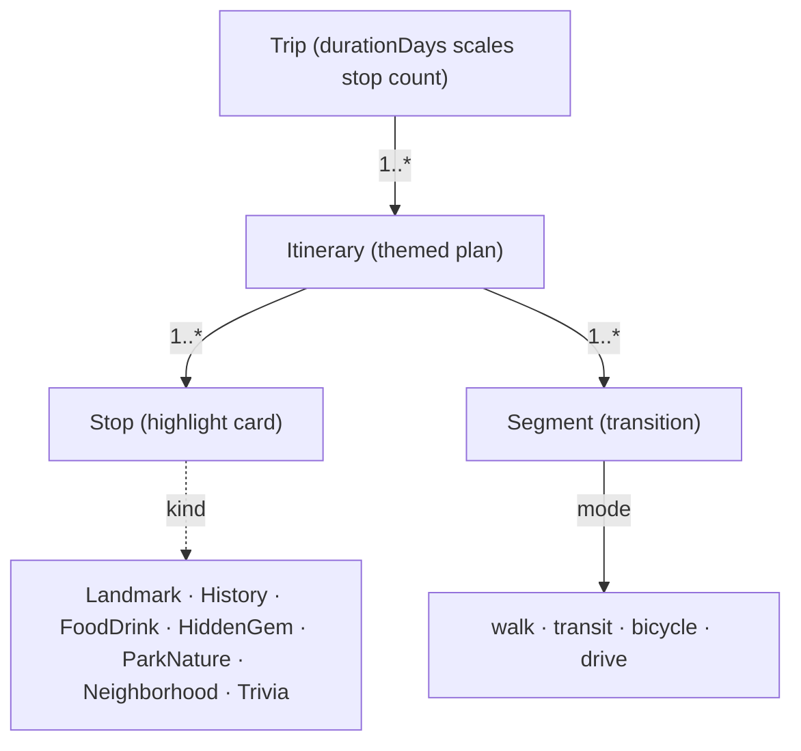
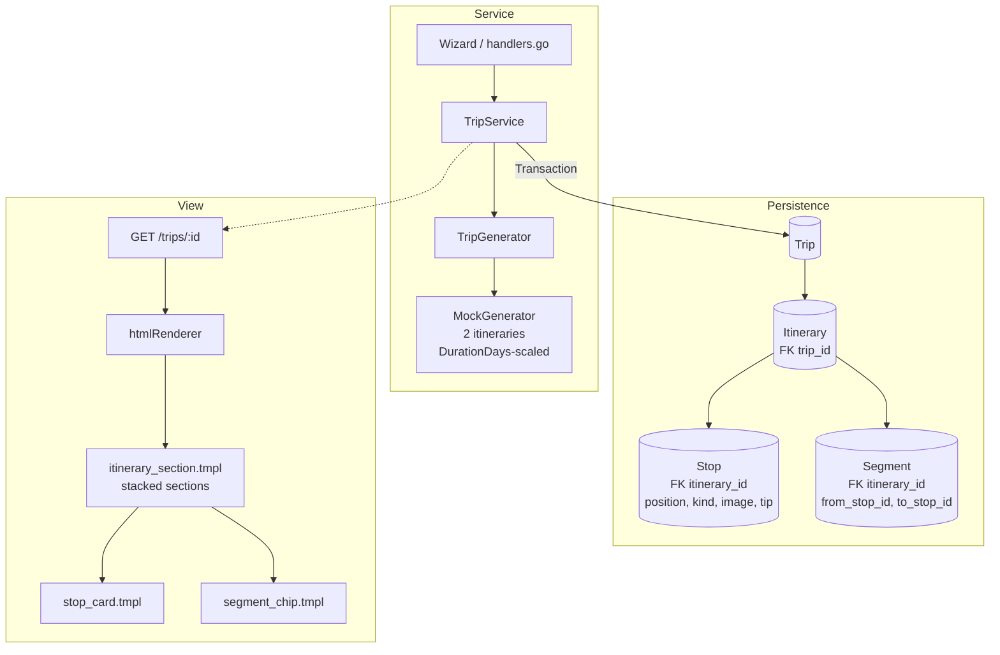
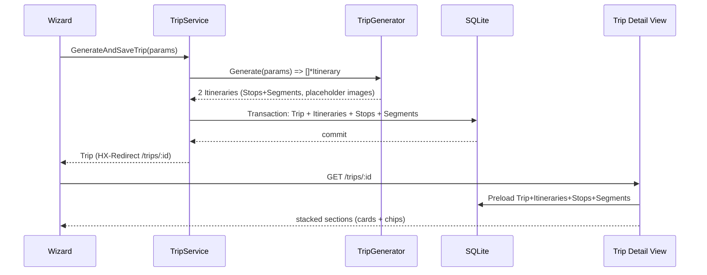

## Goal Capsule

- **Objective:** Replace the single-blob trip model with a normalized, trip-centered domain where a Trip owns many themed itineraries, each a flat sequence of highlight-card Stops joined by transition Segments, and the trip detail view renders all itineraries as stacked sections.
- **Means:** Breaking change to `internal/trip` and `cmd/web` — split `ItineraryJSON` into `Trip`, `Itinerary`, `Stop`, and `Segment` tables with a fresh SQLite reset; collapse `Stop`/`HighlightCard`/`CoolFactCard`/`DayPlan` into a uniform Stop; rebuild the detail view around stacked sections (KTD1, KTD4, KTD5).
- **Authority:** Product Contract governs trip→itinerary→stop→segment hierarchy, card kinds, segment shape, image lifecycle, and view contract; Planning Contract governs GORM schema, transaction boundary, generator contract, and template structure.
- **Stop Conditions:** All Go packages compile cleanly (`go build ./...`), `go test ./...` passes on rewritten tests, the app boots on a fresh schema with no legacy read, and `/trips/{id}` renders stacked itineraries with Stop cards and Segment chips.
- **Execution Profile:** Sequential unit implementation ordered by foundational dependencies: Domain Models & Schema -> Service & Transaction -> Generator Contract -> View Layer -> Handlers & Integration.

---

## Product Contract

### Summary

Rebuild the domain models so a Trip is the base entity with many alternative Itineraries, each holding ordered highlight-card Stops and the Segments between them. Every Stop is a uniform card (image + text + optional tip, kind-tagged); every Segment carries mode, distance, and duration. The old day-segmented `ItineraryJSON` blob, `DayPlan`, `HighlightCard`, and `CoolFactCard` are removed. The trip detail view renders all itineraries as stacked sections. The schema ships as a fresh reset — the local dev DB is recreated, legacy data is not migrated. A companion visual flow lives at `docs/model-rebuild-flow.html`.

*Product Contract preservation: restructured, no scope change — R7 split into R11/R12/R13 (segment shape / N-1 invariant / mode enum), R9 split into R9/R10 (count / sizing), view requirements extracted as R21/R22, transaction as R15, image lifecycle as R19, tip as R8; new R23 for tests. All KDs retained and extended with KD6-KD10.*

### Problem Frame

The current model stores one serialized `Itinerary` inside a single `ItineraryJSON` column, with stops split into Morning/Afternoon/Evening `DayPlan`s and three overlapping card types (`Stop`, `HighlightCard`, `CoolFactCard`). That shape cannot express multiple itineraries per trip, mixes trivia with located cards, and hides structure inside a JSON blob that GORM cannot query. The rebuild makes the trip→itinerary→card→segment hierarchy first-class and queryable.

### Key Decisions

- **KD1. Itinerary is a themed / alternative plan, not a day.** (session-settled: user-directed — chosen over day / both / sub-day: user wants alternative plans such as "Relaxed foodie" vs "Packed museums", explicitly not day buckets). Governs R1, R2, R3, R20.
- **KD2. One uniform Stop type with a kind discriminator; old card types eliminated.** (session-settled: user-approved — agent proposed folding CoolFact into a Trivia kind; user assented and confirmed the old card can be eliminated). Governs R4, R5.
- **KD3. Images come from BFL Flux (future, async); placeholders now.** (session-settled: user-directed — chosen over Wikimedia / Unsplash / generator-URL: user named BFL Flux for generation). Governs R6, R17, R18, R19.
- **KD4. Classical normalized tables with foreign keys.** (session-settled: user-directed — chosen over JSON blob / hybrid: user asked for "super simple and classical" tables). Governs R14, R15.
- **KD5. Segment distance/mode via generator estimates now, simple external API later.** (session-settled: user-directed — chosen over real-routing-now / mode-only: user deferred to "some simple external api" in the future). Governs R11, R12, R13.
- **KD6. The generator decides how many itineraries a trip gets.** (session-settled: user-directed — chosen over user-picks-in-wizard / fixed themed set / derived-from-inputs). The deterministic mock returns exactly 2 itineraries. Governs R9.
- **KD7. DurationDays scales itinerary length.** (session-settled: user-directed — chosen over trip-level-hint-only / drop-DurationDays: more trip days means more stops per itinerary). Governs R10.
- **KD8. Trip detail renders itineraries as stacked sections.** (session-settled: user-directed — chosen over tabs-switcher / decide-later: all alternatives visible on one page). Governs R21, R22.
- **KD9. Schema reset, not migration.** (session-settled: user-directed — chosen over versioned migration / AutoMigrate-and-ignore: existing trips are throwaway mock data; the local SQLite dev DB is deleted and recreated). Governs R16.
- **KD10. Stop carries an optional tip field.** (session-settled: user-directed — chosen over fold-into-body / drop-tips: practical advice like "order the cacio e pepe" stays distinct from narrative body text). Governs R8.

### Requirements

**Domain model and relations**

- R1. A Trip owns many Itineraries (1—*).
- R2. An Itinerary is a themed / alternative plan carrying title, theme, summary, and bestSeason; it is not tied to a calendar day.
- R3. An Itinerary owns many Stops (1—*, ordered by position) and many Segments (1—*).
- R4. A Stop is a highlight card discriminated by `kind` from the set {Landmark, History, FoodDrink, HiddenGem, ParkNature, Neighborhood, Trivia}.
- R5. The Trivia kind is location-anchored like any other Stop (carries lat/lon); the former standalone CoolFactCard is removed.

**Card content**

- R6. Every Stop always has an image and text (a title plus a body), regardless of kind.
- R7. A Stop may carry location (lat, lon, neighborhood, wikiQuery) and a recommendedMinutes visit duration.
- R8. A Stop may carry a tip — short practical advice (e.g. what to order, how to skip the line) distinct from the narrative body; the old `Tip`/`TransitTip` fields fold into this field and into Segment.instruction.

**Itinerary count and sizing**

- R9. The generator decides how many itineraries a trip receives; the deterministic mock returns exactly 2.
- R10. Trip.DurationDays scales the number of stops in each itinerary (more days => longer stop sequences); itineraries remain flat lists, not day buckets.

**Segments and routing**

- R11. A Segment connects two consecutive Stops within one Itinerary and carries mode, distanceMeters, durationMinutes, and instruction.
- R12. Exactly one Segment exists between each pair of consecutive Stops (N stops => N-1 segments).
- R13. Segment mode is drawn from {walk, transit, bicycle, drive}; Trip.Mobility informs mode selection but is not itself a mode. Segments are populated by generator estimates today; a simple external routing API backfills real distance/mode later without changing the Segment shape.

**Persistence**

- R14. Trip, Itinerary, Stop, and Segment are each their own GORM table with foreign keys; the legacy `ItineraryJSON` column is removed.
- R15. The service persists a trip together with its itineraries, stops, and segments in one transaction — a partial save is never visible.
- R16. The schema ships as a fresh reset: the local SQLite dev DB is deleted and recreated on the new schema; legacy rows are neither migrated nor read.

**Images**

- R17. `Stop.image` stores {url, alt, credit, source, prompt?}.
- R18. Image generation is a separate async stage after itinerary build (BFL Flux), not inside the synchronous TripGenerator.
- R19. `Stop.image` starts as a placeholder and is upgraded in place by the image pipeline; the image url is never empty and no missing-image state is ever rendered.

**Generator and service contract**

- R20. The TripGenerator interface returns one or more Itineraries (each with Stops and Segments) instead of the current single `*Itinerary`; `CreateTripParams` and `TripService` are updated to match.

**View**

- R21. The trip detail page renders every itinerary of a trip as a stacked section, one section per itinerary, in order.
- R22. Each section renders its ordered Stop cards (image, kind badge, title, body, tip) joined by Segment chips showing mode · distance · duration; `hasItinerary` and the old day-based partials are replaced.

**Tests**

- R23. The existing test suite (model, service, generator, handlers, wizard integration) is rewritten against the new shapes; the mock's fixed 2-itinerary output keeps generation deterministic.

### Key Flows

- F1. Create trip
  - **Trigger:** User completes the wizard (city + preferences).
  - **Steps:** TripGenerator builds one or more Itineraries sized by DurationDays, each with ordered Stops and Segments; the service persists Trip + Itineraries + Stops + Segments in one transaction; the trip detail view renders each itinerary as a stacked section of Stop cards joined by Segment chips (mode · distance · time).
  - **Covers:** R1, R2, R3, R9, R10, R11, R12, R14, R15, R20, R21, R22.
- F2. Attach images
  - **Trigger:** An itinerary is saved.
  - **Steps:** Stops carry placeholder images at save time; a later async stage generates images via BFL Flux and upgrades `Stop.image` in place; the mock skips this and keeps placeholders.
  - **Covers:** R6, R17, R18, R19.

### Acceptance Examples

- AE1. A Trip with two alternative itineraries renders both as stacked sections; each shows ordered Stop cards (image + title + body) joined by Segment chips showing mode, distance, and time.
  - **Covers:** R1, R2, R3, R6, R9, R11, R21, R22.
- AE2. A Trivia Stop renders as a uniform card with a location like any other kind; no separate trivia list appears.
  - **Covers:** R4, R5.
- AE3. With no BFL Flux wired, a generated trip still renders every card with a placeholder image; no missing-image state occurs.
  - **Covers:** R6, R17, R19.
- AE4. The app boots on the fresh schema after the dev DB reset; no legacy `ItineraryJSON` data is read.
  - **Covers:** R14, R16.
- AE5. A 7-day trip's itineraries contain meaningfully more stops than a 2-day trip's; each itinerary has exactly one Segment between consecutive stops.
  - **Covers:** R10, R12.

### Scope Boundaries

- **Deferred for later:** BFL Flux image pipeline (KD3), simple external routing API for real distances (KD5), and the exact Go return-type signature of the refactored TripGenerator (R20 fixes the contract, not the signature).
- **Outside this product's identity:** keeping the old `DayPlan` / Morning-Afternoon-Evening structure, the separate `HighlightCard` and `CoolFactCard` types, any per-day concept (rejected by KD1), versioned migration tooling for throwaway dev data (rejected by KD9), and `accessible` as a transport mode (it is a mobility input, not a mode).

### Outstanding Questions

- **Deferred to Planning:** GORM column types and nullability for each table; exact Go signature of the refactored TripGenerator; placeholder image source for the mock; Stop.kind -> badge/icon mapping in the templates.

### Sources / Research

- `internal/trip/model.go` — current Trip / Itinerary / DayPlan / Stop / HighlightCard / CoolFactCard and the `ItineraryJSON` blob.
- `internal/trip/service.go` — TripService and `CreateTripParams`.
- `internal/trip/generator.go` — `TripGenerator` returning a single `*Itinerary`.
- `internal/trip/generator_mock.go` — deterministic fixtures being replaced.
- `cmd/web/handlers.go`, `cmd/web/html.go`, `assets/html/pages/trip_detail.tmpl`, `assets/html/partials/daily_route.tmpl` — day-based view layer to be rebuilt.
- `internal/database/database.go` — SQLite setup and AutoMigrate site for the schema reset.
- `CONCEPTS.md` — existing domain vocabulary to be revised after this plan.
- `docs/model-rebuild-flow.html` — the visual flow this plan encodes.

---

## Planning Contract

### Key Technical Decisions

- KTD1. **Four-table normalized GORM schema with FK cascade.** Trip, Itinerary, Stop, Segment are each a GORM model with `gorm:"primaryKey"` ID and `OnDelete:CASCADE` foreign keys (`Itinerary.TripID`, `Stop.ItineraryID` + `Position`, `Segment.ItineraryID` + `FromStopID`/`ToStopID`). Stop carries `Kind` validated against the 7-value enum; `Image` is stored as owned columns (url, alt, credit, source, prompt) or a JSON column with a typed struct — either is acceptable if queried via GORM. `Trip.ItineraryJSON` and `GetItinerary`/`SetItinerary` are removed. Governs R14, R4, R5.
- KTD2. **Single-transaction persistence in TripService.** `CreateTrip`/`GenerateAndSaveTrip` wrap `db.Transaction` around Trip + all Itineraries + Stops + Segments; any failure rolls back the whole trip. Preloads use `Preload("Itineraries.Stops")` and `Preload("Itineraries.Segments")` ordered by `position`. Governs R15, R16.
- KTD3. **Generator returns multiple itineraries; DurationDays scales stops.** `TripGenerator.Generate` changes from `(*Itinerary, error)` to `([]*Itinerary, error)` (or equivalent slice return) where each Itinerary already contains its Stops and Segments. Mock scales stops per itinerary by DurationDays (e.g. ~4-5 stops per day, clamped) to satisfy R10, always returns exactly 2 themed itineraries to satisfy R9. `CreateTripParams` drops the single `Itinerary` field in favor of `Itineraries`. Governs R9, R10, R20, R12, R13.
- KTD4. **Image lifecycle: placeholder never empty, async upgrade in place.** Every Stop is created with a placeholder image (derived URL) so R19 holds from save time; the future BFL Flux stage updates `Stop.image` columns in place. The mock never leaves `image.url` empty. No separate image table. Governs R6, R17, R18, R19.
- KTD5. **Stacked-section view replaces day-based partials.** `assets/html/pages/trip_detail.tmpl` renders `range .Itineraries` as stacked sections; each section uses new partials `itinerary_section.tmpl` / `stop_card.tmpl` / `segment_chip.tmpl`. `cmd/web/html.go:hasItinerary` checks `len(itineraries) > 0` instead of `len(it.Days)`. `categoryBadgeClass`/`categoryIcon` are extended to map the new Stop kinds. `daily_route.tmpl` is removed or repurposed. Governs R21, R22.
- KTD6. **Fresh SQLite reset, no migration tooling.** On startup `internal/database/database.go` calls `AutoMigrate` for the four new tables on an empty DB; existing dev DB file is deleted manually (documented in README/run instructions). `AutoMigrate` is not expected to drop the old `ItineraryJSON` column on existing files — the reset avoids the need. Governs R16, R14.
- KTD7. **Deterministic mock + rewritten test suite.** Mock keeps table-driven fixtures (Rome vs generic city) but emits the new shapes; tests use `glebarez/sqlite` in-memory DB. Handler tests assert stacked-section HTML and `HX-Redirect` behavior. Wizard integration test drives city search -> generate -> `/trips/{id}` and asserts Segment N-1 invariant. Governs R23.

### High-Level Technical Design

### Assumptions

- Trip.DurationDays default remains 1 when unset; validation 1..30 unchanged.
- Trip.Interests stays a comma-separated text column (out of scope for this refactor).
- BFL Flux and external routing are future stages; this plan fixes only their Segment/image shapes.

### System-Wide Impact

- Data lifecycle: legacy `ItineraryJSON` rows are discarded, not migrated.
- Templates and handlers are breaking changes; old `daily_route.tmpl` and `hasItinerary` logic are replaced.
- No auth or multi-tenant impact; trips remain globally listable.

---

## Implementation Units

### U1. Normalized domain models and schema reset
- **Goal:** Replace the blob model with four GORM tables and a fresh SQLite schema.
- **Requirements:** R14, R4, R5, R16 (Covers AE4)
- **Dependencies:** None
- **Files:**
  - `internal/trip/model.go`
  - `internal/database/database.go`
  - `CONCEPTS.md`
  - `docs/model-rebuild-flow.html`
- **Approach:**
  1. Define `Itinerary`, `Stop`, `Segment` as GORM models with FKs and cascade deletes; add `Stop.Kind`, `Stop.Image` (url/alt/credit/source/prompt), `Stop.Tip`, `Stop.Position`, `Stop.RecommendedMinutes`, `Segment` fields (mode/distanceMeters/durationMinutes/instruction/from/to).
  2. Remove `Trip.ItineraryJSON`, `GetItinerary`/`SetItinerary`, `DayPlan`, `HighlightCard`, `CoolFactCard`.
  3. Update `internal/database/database.go` to `AutoMigrate` the four tables; document the dev DB reset (delete file) in code comment/README.
  4. Sync `CONCEPTS.md` and `docs/model-rebuild-flow.html` (Stop tip, mode enum fix, N-1 invariant).
- **Patterns to follow:** Existing GORM tags in `internal/trip/model.go` (`gorm:"primaryKey"`, `gorm:"size:255"`), `internal/database/database.go` AutoMigrate pattern.
- **Test scenarios:**
  - Covers AE4. Migrating an empty DB creates Trip, Itinerary, Stop, Segment tables with FK constraints.
  - Creating a Trip with two Itineraries each with 3 Stops and 2 Segments persists and preloads correctly ordered by position.
  - Deleting a Trip cascades to Itineraries, Stops, and Segments.
  - `Stop.Kind` rejects an unknown kind value.
- **Verification:** `go test ./internal/trip -run TestModel -v` and manual `go run ./cmd/web` boots on a fresh DB with no legacy read.

### U2. TripService transaction and persistence update
- **Goal:** Make TripService persist trips with all itineraries, stops, and segments atomically and serve them preloaded.
- **Requirements:** R1, R2, R3, R15, R16, R20 (Covers F1)
- **Dependencies:** U1
- **Files:**
  - `internal/trip/service.go`
  - `internal/trip/service_test.go`
  - `internal/trip/model.go`
- **Approach:**
  1. Update `CreateTripParams` to carry `Itineraries []*Itinerary` instead of single `Itinerary`.
  2. Rewrite `CreateTrip` to use `db.Transaction` inserting Trip then Itineraries then Stops/Segments.
  3. Update `ListTrips` and `GetTripByID` to `Preload` itineraries with stops (ordered by position) and segments.
  4. Update `GenerateAndSaveTrip` to call the new generator signature and forward the slice.
  5. Keep `Validate` unchanged except ensuring `Itineraries` handling does not bypass validation.
- **Patterns to follow:** Existing `service` struct with `*gorm.DB`, `ErrNotFound` handling, `ValidationError` pattern in `internal/trip/service.go`.
- **Test scenarios:**
  - Covers F1. `CreateTrip` with 2 itineraries (3 stops each) commits all rows; `GetTripByID` returns them ordered.
  - Transaction rolls back if a Stop insert fails — no partial Trip remains.
  - `ListTrips` returns trips with preloaded itineraries ordered by `created_at DESC`.
  - `GetTripByID` for missing id returns `ErrNotFound`.
- **Verification:** `go test ./internal/trip -run TestService -v` passes with in-memory SQLite.

### U3. Generator contract and mock rewrite
- **Goal:** Change TripGenerator to return multiple itineraries per trip and make the mock deterministic and DurationDays-aware.
- **Requirements:** R9, R10, R11, R12, R13, R20 (Covers AE1, AE5)
- **Dependencies:** U1, U2
- **Files:**
  - `internal/trip/generator.go`
  - `internal/trip/generator_mock.go`
  - `internal/trip/generator_test.go`
- **Approach:**
  1. Change `TripGenerator` to `Generate(ctx context.Context, params CreateTripParams) ([]*Itinerary, error)`.
  2. Rewrite `MockGenerator` to always return exactly 2 themed itineraries (e.g. "Classic highlights" vs "Relaxed foodie") with placeholder images, each sized by `DurationDays` (e.g. base 3-4 stops + ~2 per extra day, or equivalent linear scaling).
  3. Ensure each itinerary has `len(Segments) == len(Stops)-1` and modes from {walk, transit, bicycle, drive} influenced by `Mobility`.
  4. Keep deterministic fixtures: Rome template with curated stops vs generic city template, both adapted to new shapes.
- **Patterns to follow:** Existing `MockGenerator` deterministic branching on city name in `internal/trip/generator_mock.go`; `TripGenerator` interface seam in `internal/trip/generator.go`.
- **Test scenarios:**
  - Covers R9. Mock returns exactly 2 itineraries for any city.
  - Covers R10 / AE5. A 2-day trip has fewer stops than a 7-day trip (linear scaling).
  - Covers R12. Every itinerary has N-1 segments where N = len(Stops).
  - Covers R11. Every segment carries mode, distanceMeters, durationMinutes, instruction.
  - Generic city (non-Rome) still returns valid 2-itinerary output.
- **Verification:** `go test ./internal/trip -run TestGenerator -v` passes.

### U4. Trip detail view rebuild for stacked itineraries
- **Goal:** Replace the day-based trip detail view with stacked itinerary sections rendering Stop cards and Segment chips.
- **Requirements:** R6, R7, R8, R17, R19, R21, R22 (Covers AE1, AE2, AE3)
- **Dependencies:** U1, U2
- **Files:**
  - `cmd/web/html.go`
  - `assets/html/pages/trip_detail.tmpl`
  - `assets/html/partials/daily_route.tmpl`
  - `assets/html/partials/stop_card.tmpl`
  - `assets/html/partials/segment_chip.tmpl`
  - `assets/html/partials/itinerary_section.tmpl`
  - `assets/static/css/custom.css`
- **Approach:**
  1. Replace `hasItinerary` to check `len(itineraries) > 0` and add helpers for `kindBadgeClass`/`kindIcon` mapping new kinds; keep `osmLink`/`googleMapsLink`/`wikiLink` as is.
  2. Create `stop_card.tmpl` (image, kind badge, title, body, tip, neighborhood, wiki link) and `segment_chip.tmpl` (mode · distance · duration · instruction).
  3. Create `itinerary_section.tmpl` (title/theme/summary/bestSeason header + ordered stops interleaved with segment chips) and update `trip_detail.tmpl` to `range` itineraries as stacked sections.
  4. Remove or repurpose `daily_route.tmpl` (day-based); ensure every Stop always renders an image (placeholder never empty per R19).
- **Patterns to follow:** Existing `htmlRenderer` FuncMap and `ParseFS` pattern in `cmd/web/html.go`; `assets/html/partials/trip_card.tmpl` Pico.css card styling.
- **Test scenarios:**
  - Covers AE1. Rendering a trip with 2 itineraries produces two stacked sections each with ordered cards and chips.
  - Covers AE2. A Trivia-kind Stop renders with the same card layout and a location link.
  - Covers AE3. Every Stop renders an image element even when source is placeholder.
  - `kindBadgeClass` maps each of the 7 kinds to a distinct badge class.
- **Verification:** `go test ./cmd/web -run TestHTML -v` passes; manual `go run ./cmd/web` renders `/trips/{id}` with stacked sections.

### U5. Handlers, wiring, and test sweep
- **Goal:** Wire the new service/generator/view together and rewrite the remaining tests.
- **Requirements:** R1, R14, R15, R16, R20, R21, R23 (Covers F1, F2, AE4)
- **Dependencies:** U1, U2, U3, U4
- **Files:**
  - `cmd/web/handlers.go`
  - `cmd/web/handlers_test.go`
  - `cmd/web/html_test.go`
  - `cmd/web/wizard_integration_test.go`
  - `cmd/web/main.go`
  - `internal/trip/model_test.go`
- **Approach:**
  1. Update `handlers.go:tripDetailVM` and `showTrip` to load `Trip` with preloaded itineraries/stops/segments and pass them to the new template; remove `GetItinerary` calls.
  2. Update `main.go` wiring if generator/service signatures changed; ensure DB reset is documented.
  3. Rewrite `handlers_test.go`, `html_test.go`, `wizard_integration_test.go`, `model_test.go`, `service_test.go` against new shapes; keep tests deterministic via MockGenerator.
  4. Delete stale assertions on `DayPlan`/`HighlightCard`/`CoolFactCard`/`ItineraryJSON`.
- **Patterns to follow:** Existing handler test patterns with `httptest` and in-memory SQLite in `cmd/web/handlers_test.go`; `wizard_integration_test.go` full-flow pattern.
- **Test scenarios:**
  - Covers AE4. `GET /trips/{id}` for an existing trip returns 200 with stacked sections; missing id returns 404.
  - Wizard flow: `POST /trips/generate` with valid params returns `HX-Redirect` to `/trips/{id}` and the detail page renders.
  - Validation: missing destination or out-of-range DurationDays returns 422 with field errors.
  - Integration: full wizard -> generate -> detail flow asserts N-1 segments and placeholder images.
- **Verification:** `go test ./... -v` passes; `go build ./...` succeeds; `go vet ./...` clean.

---

## Verification Contract

| Check | Command | Scope |
|-------|---------|-------|
| Unit tests | `go test ./... -v` | All packages — models, service, generator, handlers, wizard integration |
| Build | `go build ./...` | Compiles with no cgo dependency drift |
| Vet | `go vet ./...` | No vet warnings |
| Manual smoke | `go run ./cmd/web` then `GET /` -> wizard -> generate -> `/trips/{id}` | Stacked itineraries render with cards and chips; 404 for unknown id |

---

## Definition of Done

- [ ] U1. Four-table schema replaces `ItineraryJSON`; fresh DB boots with no legacy read (AE4).
- [ ] U2. TripService persists and preloads trips atomically in one transaction (F1).
- [ ] U3. MockGenerator returns exactly 2 DurationDays-scaled itineraries with N-1 segments (R9, R10, AE5).
- [ ] U4. Trip detail renders stacked sections with Stop cards (image/title/body/tip) and Segment chips (AE1, AE2, AE3).
- [ ] U5. Handlers and all tests rewritten; `go test ./...` and `go build ./...` pass.
- [ ] Abandoned-attempt code from the DayPlan/blob era is removed (no dead `GetItinerary`/`SetItinerary`/`daily_route` remnants).
- [ ] `CONCEPTS.md` and `docs/model-rebuild-flow.html` are consistent with the new model.

---

## Appendix

### Outstanding Questions (deferred, non-blocking)

- GORM column types and nullability per table — resolved in U1 during implementation.
- Exact Go signature of `TripGenerator.Generate` return slice — resolved in U3 (slice of itineraries vs wrapper struct).
- Placeholder image source for mock — resolved in U3/U4 (derived/placeholder URL, never empty).
- Stop.kind -> badge/icon mapping details — resolved in U4.
