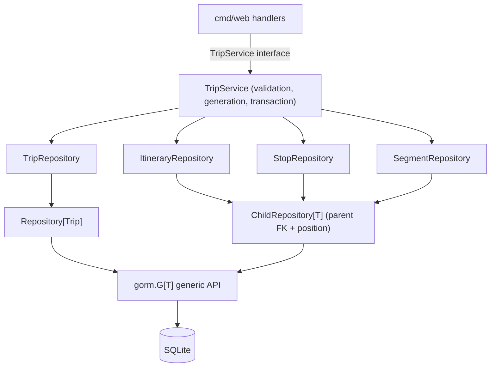
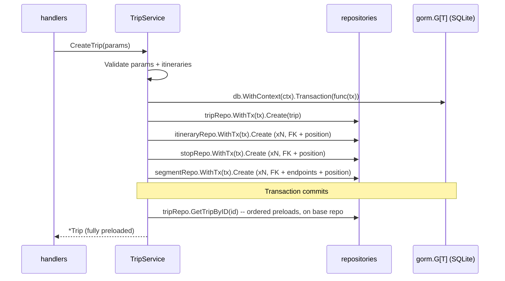

## Goal Capsule

- **Objective:** The trip persistence code is simple and duplication-free: one slim, domain-free generic persistence toolkit, thin per-model repositories that compose it, and a trip service that owns all business rules — with zero change to user-visible behavior.
- **Means:** Rebuild the rejected working-tree attempt (uncommitted restructure) into a layered shape: `Repository[T]`/`ChildRepository[T]` generics in `internal/repository`, thin trip repositories over them, and a restored `TripService` for validation, generator orchestration, and the atomic save transaction (KTD1, KTD2).
- **Authority:** The user request governs structure goals — leverage Go generics, keep the code simple and reusable, eliminate duplication. External research (GORM's official generics guidance for v1.30+, idiomatic Go repository practice) governs the technical shape. The existing test suite governs behavior parity.
- **Stop Conditions:** `go build ./...`, `go vet ./...`, and `go test ./...` pass; the three near-identical per-model service files and all dead persistence API are gone; the persistence-path placeholder-image rule exists exactly once and the ordered-preload chain exists exactly once; the wizard-to-detail flow behaves exactly as before.
- **Execution Profile:** Sequential units ordered by dependency: generic toolkit → per-model repositories → trip service → web wiring and verification.

---

## Product Contract

### Summary

This plan restructures the trip persistence layer: one slim generic repository toolkit (built on GORM's generics API) that trip's per-model repositories compose, plus a separate trip service owning validation, generator orchestration, and the atomic save transaction. The three near-identical per-model persistence files collapse into thin generic compositions, and duplicated business logic (the placeholder-image rule exists twice today) is deduplicated. Purely internal: no user-visible or schema changes, no new dependencies, existing tests keep passing (rewritten only where names move).

### Problem Frame

The working tree holds a restructure attempt that replaced `internal/trip/service.go` with a merged `trip_repository.go` plus three near-identical per-model services. That attempt is off in five ways:

1. `itinerary_service.go`, `stop_service.go`, and `segment_service.go` repeat ~90% of the same code (Create, CreateInBatches, GetByID, ListByParent, Update, Delete, CountByParent) and differ only in the model type and parent FK column — exactly the duplication generics should absorb.
2. The per-model services bypass the generic layer they claim to use: Update/Delete/Count call `gorm.G[T](s.db)` directly instead of the composed `Repository[T]`.
3. The generic `Repository[T]` is bloated and half-dead: `PreloadFind`, `FindWhere`, `FirstWhere`, `DeleteWhere`, and the awkward `Update(query, args, field, value)` signature are never called; `CreateWithTx` methods exist on every service and are called nowhere; the `itineraryService`/`stopService`/`segmentService` fields in `tripRepository` are never used.
4. `tripRepository` mixes concerns: input validation, placeholder-image derivation, and save orchestration sit in what is named a repository, while the sibling files are named "Service" — inconsistent naming and roles.
5. The placeholder-image rule is implemented twice: `placeholderImageURL`/`urlSafeSeed` in the repository layer duplicate the same logic in `Stop.BeforeCreate` (model hook).

The uncommitted deletions of `service.go`/`service_test.go` make this a live restructure on branch `feat/trip-model-rebuild`; this plan replaces that attempt rather than building on it.

### Requirements

- R1. The generic persistence toolkit lives in `internal/repository`, imports no project domain packages, and provides a slim, fully test-covered repository contract: create, find by id, find all, struct updates, delete by id (load-then-delete so model hooks see a populated primary key), count, and child-collection access (list by parent FK ordered by position, count by parent).
- R2. The toolkit rebinds onto a transaction handle (`WithTx`), so transaction bodies compose repositories over the tx and never take raw per-model GORM calls.
- R3. Trip persistence operations (create, preloaded get-by-id, preloaded list) share one ordered-preload chain — itineraries, then their stops and segments, ordered by position — defined once, not per method.
- R4. Itinerary, Stop, and Segment persistence are thin generic compositions of the toolkit with no copied CRUD boilerplate.
- R5. Business rules live only in the trip service: input validation, generator orchestration, and the single-transaction save. Repositories contain no validation or derivation logic.
- R6. The placeholder-image derivation in the persistence path exists exactly once, in the Stop model hook, and every save path honors it. The mock generator's pre-filled image URLs are input data (like titles), not a second persistence rule.
- R7. The web layer depends on a single trip service interface exposing exactly the operations handlers use: create, generate-and-save, get by id, list.
- R8. Behavior parity: no schema, endpoint, template, or user-visible behavior change. The existing test suite passes with only identifier-level rewrites, and the app boots against the existing database file.
- R9. No new dependencies; all persistence goes through GORM's built-in generics API (v1.31.2, already in `go.mod`).

### Success Criteria

- SC1. `go build ./...` and `go vet ./...` are clean.
- SC2. `go test ./...` passes.
- SC3. Duplication eliminated: the three per-model service files are gone; no file repeats Create/Update/Delete/Count/list-by-parent logic; the placeholder derivation and the ordered-preload chain each have one production definition.
- SC4. No dead persistence code remains in the per-model or service layers: no `CreateWithTx`, no unused per-model methods, no unused struct fields. The generic toolkit's slim surface is its deliberate reusable contract, each method covered by its own tests.
- SC5. Manual smoke behaves as before: wizard → generate → `/trips/{id}` renders stacked itineraries; the home list renders; unknown trip id returns 404.

### Scope Boundaries

- **Deferred for later:** nothing — this refactor is self-contained.
- **Outside this product's identity:** any schema change, migration tooling, new endpoints, new dependencies, the BFL Flux image pipeline, the routing API, and restructuring of `internal/nominatim`, `internal/config`, `internal/database`, or `internal/trip` generator/mock files. README updates are limited to lines this refactor invalidates; unrelated staleness in that file stays out of scope.

### Sources / Research

- `internal/repository/repository.go`, `internal/trip/trip_repository.go`, `internal/trip/itinerary_service.go`, `internal/trip/stop_service.go`, `internal/trip/segment_service.go`, `internal/trip/model.go` — the current (rejected) structure.
- `git show HEAD:internal/trip/service.go` — the pre-refactor service seam this plan restores.
- `cmd/web/main.go`, `cmd/web/handlers.go`, `cmd/web/handlers_test.go`, `cmd/web/wizard_integration_test.go` — the only consumers of the trip persistence surface.
- GORM docs, "The Generics Way to Use GORM" (gorm.io/docs/the_generics_way.html) — GORM ≥1.30 officially recommends the generics API for refactorings; the project is on v1.31.2. The generics API returns errors from finishers, is chain-pollution-safe, supports `Preload` with typed builders, and omits ambiguous `FirstOrCreate`/`Save`.
- Go structure practice (e.g., "Repository pattern in Go service", pawelgrzybek.com) — domain-first packages, consumer-defined interfaces, repositories as pure persistence, no repository facade over an already-generic ORM.

---

## Planning Contract

### Key Technical Decisions

- KTD1. **Slim domain-free generic toolkit.** `internal/repository` holds `Repository[T]` (Create, FindByID, FindAll, Update, Delete, Count, `WithTx`, and a `DB()` escape hatch) and `ChildRepository[T]` (parent FK column + position ordering: `ListByParent`, `CountByParent`, own `WithTx`), all implemented over `gorm.G[T]`. `Delete` is load-then-delete (`FindByID` then `Delete(&entity)`) so `AfterDelete` cascade hooks receive a populated primary key — the generics `Where("id = ?", id).Delete` form passes a zero-value model and silently skips hook cascades. Rejected: keeping the current fat catalog with unused `interface{}`-argument methods (including the never-called `CreateInBatches`); per-model raw `gorm.G` chains (re-spreads parent queries and preload chains); a third-party generic-repository dependency (adds a dependency GORM itself already covers).
- KTD2. **Service/repository split.** A restored `TripService` owns validation, generator orchestration, and the single-transaction save; repositories are pure persistence. The web layer consumes the exported `TripService` interface. Rejected: the current merged `TripRepository`, which puts business rules in persistence and contradicts the "Service" naming of its siblings.
- KTD3. **Concrete repositories, interface at the consumer seam only.** Per-model repositories are concrete structs/compositions; no per-model interfaces. Tests exercise them with real in-memory SQLite, matching the existing test pattern, and the only mock seam stays `TripService` for the web layer. Rejected: interface-per-repository for mocking (nothing mocks them today; the current tests already use the real database).
- KTD4. **Transactions via GORM `Transaction` plus `WithTx` rebinding.** The service opens `db.WithContext(ctx).Transaction(...)` and constructs tx-scoped repositories inside the closure. Rejected: the current dead `CreateWithTx` pattern and any per-method `tx` parameters.
- KTD5. **Single-source rules.** Placeholder-image derivation lives only in `Stop.BeforeCreate`; the service sets only structural fields (foreign keys, positions, segment endpoints). Rejected: keeping the repository-layer copy of `urlSafeSeed`/`placeholderImageURL`.
- KTD6. **Behavior-preserving refactor.** The only public-surface change is the identifier rename `TripRepository` → `TripService` (and constructor `NewTripRepository` → `NewService`) in the web wiring; existing tests are the characterization contract.

### Risks & Dependencies

- **Parity regression from the restructure.** Risk: subtle behavior drift (ordering, error mapping, soft-delete scope, context propagation) while touching every persistence file. Mitigation: the existing handler/wizard/model test suites are the contract; U4 runs them pre- and post-refactor and requires identical pass/fail (behavior-parity execution note).
- **Association auto-save double-insert.** Risk: creating an itinerary whose `Stops`/`Segments` slices are still populated makes GORM's `SaveAfterAssociations` insert the children, and the explicit loops then insert them again, breaking the N−1 invariant. Mitigation: U3 explicitly nulls the child slices before the itinerary create (R8-preserving, matches today's code).
- **Soft-delete cascade skip via zero-value hooks.** Risk: a generic `Where("id = ?").Delete` never populates the model, so `AfterDelete` hooks (which guard on `ID == 0`) skip cascading. Mitigation: KTD1's load-then-delete and a U2 cascade test through the repository path.
- **Read-after-write visibility and rollback semantics.** Risk: reloading the trip inside the open transaction on a non-tx-scoped repository reads a different pool connection and misses uncommitted rows; moving the reload inside the tx would instead roll back committed work on preload failure. Mitigation: reload after `Transaction` returns, on the base repository, exactly as today (U3; diagram shows this).
- **Generator pre-filled images vs single-sourced rule.** Risk: the mock generator's `placeholderFor` derives placeholder URLs itself, so the hook path is a no-op for generated trips. Mitigation: R6 classifies generator output as input data; the hook remains the persistence-path guarantee, exercised by an empty-image save test.

### Assumptions

- Itinerary/Stop/Segment repositories need no custom methods beyond the generic toolkit today; future richer queries extend the thin types via the `DB()` escape hatch.
- The pre-refactor `service_test.go` (still at HEAD) is restored as the starting point for the rewritten service tests.
- Handlers never use the extra CRUD helpers (Create/Delete/Count) the current repository exposes; the service interface narrows to the four operations handlers call.

### System-Wide Impact

- Developers only: an internal restructure with no end-user, operations, or data impact.
- `cmd/web` changes are type/constructor renames; no handler logic changes.
- `internal/database` (AutoMigrate over the four models) is untouched.

### High-Level Technical Design





### Output Structure

```
internal/
├── repository/                  # domain-free generic persistence toolkit
│   ├── repository.go            # Repository[T], ChildRepository[T], WithTx
│   └── repository_test.go       # tests using a locally declared test model
└── trip/
    ├── model.go                 # unchanged (models + Stop.BeforeCreate hook)
    ├── model_test.go            # unchanged
    ├── repositories.go          # TripRepository (+ ordered preload chain), thin child repos
    ├── repositories_test.go     # replaces trip_repository_test.go
    ├── service.go               # restored TripService: validation, transaction, generator orchestration
    ├── service_test.go          # restored/rewritten
    ├── generator.go             # unchanged
    ├── generator_mock.go        # unchanged
    └── generator_test.go        # unchanged
```

Deleted: `internal/trip/itinerary_service.go`, `internal/trip/stop_service.go`, `internal/trip/segment_service.go`, `internal/trip/trip_repository.go`, `internal/trip/trip_repository_test.go`.

---

## Implementation Units

### U1. Slim generic persistence toolkit

- **Goal:** Replace the bloated `Repository[T]` with the minimal `Repository[T]` + `ChildRepository[T]`, all implemented over GORM's generics API.
- **Requirements:** R1, R2, R9
- **Dependencies:** None
- **Files:**
  - `internal/repository/repository.go`
  - `internal/repository/repository_test.go`
- **Approach:**
  1. Keep the slim repository contract on `Repository[T]`: `Create`, `FindByID`, `FindAll`, `Update` (struct updates by entity ID), `Delete` (by ID, implemented load-then-delete so model hooks see the populated primary key), `Count`, `WithTx`, and `DB()` as the escape hatch for advanced queries.
  2. Add `ChildRepository[T]` embedding `Repository[T]`: `NewChild[T](db, parentColumn)`; `ListByParent` and `CountByParent` query `parentColumn = ?` ordered by `position ASC`; its own `WithTx` must return `*ChildRepository[T]` so child methods survive rebinding.
  3. Delete the unused and awkward methods: `PreloadFind`, `FindWhere`, `FirstWhere`, `DeleteWhere`, `CreateInBatches`, and the `Update(query, args, field, value)` / `Updates(query, args, entity)` signatures.
  4. Route every call through `gorm.G[T]`; do the `int`→`int64` conversions for Delete/Update in this one place.
  5. Test against a locally declared model in the test file (not a `trip` model) to prove the package stays domain-free.
- **Patterns to follow:** the existing `gorm.G[T]` usage in `internal/repository/repository.go`; the in-memory SQLite setup pattern from `internal/database/database_test.go`.
- **Execution note:** Write the toolkit test-first — the test scenarios below double as its specification.
- **Test scenarios:**
  - Create then FindByID roundtrip; FindByID on a missing id returns `gorm.ErrRecordNotFound`.
  - FindAll returns all rows ordered by primary key.
  - Update applies non-zero struct fields only (GORM `Updates` semantics) and returns the affected count; updating a missing id returns 0 with no error.
  - Delete returns the affected count; deleting a missing id returns 0 with no error.
  - Count on an empty and a populated table.
  - Load-then-delete behavior: a model with a `BeforeDelete`/`AfterDelete` hook observes a populated primary key (the cascade correctness property is asserted end-to-end in U2 with the real trip models).
  - ChildRepository: ListByParent returns only the given parent's rows ordered by position; CountByParent counts per parent independently.
  - WithTx: operations inside `db.Transaction` commit atomically; an injected mid-transaction error rolls back earlier writes.
- **Verification:** `go test ./internal/repository` passes; the package compiles without importing any project domain package; a grep for the removed method names shows no definitions.

### U2. Thin per-model repositories in the trip package

- **Goal:** Trip, Itinerary, Stop, and Segment persistence become thin generic compositions with one shared ordered-preload chain.
- **Requirements:** R3, R4, R9
- **Dependencies:** U1
- **Files:**
  - `internal/trip/repositories.go`
  - `internal/trip/repositories_test.go`
  - Delete `internal/trip/itinerary_service.go`, `internal/trip/stop_service.go`, `internal/trip/segment_service.go`, `internal/trip/trip_repository.go`, `internal/trip/trip_repository_test.go`
- **Approach:**
  1. `TripRepository` embeds `*repository.Repository[Trip]`; `NewTripRepository(db)`.
  2. Define one preload chain helper — `gorm.G[Trip](db).Preload("Itineraries", orderByPosition).Preload("Itineraries.Stops", orderByPosition).Preload("Itineraries.Segments", orderByPosition)` — shared by `GetTripByID` (maps `gorm.ErrRecordNotFound` → `trip.ErrNotFound`) and `ListTrips` (adds `Order("created_at DESC")`).
  3. Declare `ItineraryRepository`, `StopRepository`, `SegmentRepository` as thin compositions of `repository.NewChild[T]` with parent columns `trip_id`, `itinerary_id`, `itinerary_id`; add per-model methods only if a custom query exists (none expected).
  4. Move the domain declarations currently squatting in the repository file — `ErrNotFound`, `ValidationError`, `CreateTripParams`, `validateItineraries` — to `service.go` in U3; repositories keep none of them.
  5. Remove all placeholder-image derivation from this layer; the model hook is the only persistence-path source (KTD5). `TripRepository` needs no `WithTx` of its own — the post-commit reload (U3) runs on the base repository.
- **Patterns to follow:** the preload chains and `PreloadBuilder` ordering in the current `internal/trip/trip_repository.go`; the generic constructor style in the current `internal/repository/repository.go`.
- **Test scenarios:**
  - Create a trip with itineraries, then `GetTripByID` returns itineraries with stops and segments each ordered by position.
  - `ListTrips` returns trips ordered by `created_at DESC` with the same preloads.
  - `GetTripByID` on a missing id returns `trip.ErrNotFound` via `errors.Is`.
  - Each child repository: ListByParent ordered by position; CountByParent per parent.
  - Creating a Stop through the repository yields a non-empty `ImageURL` and a placeholder source (proves the model hook, not the repository, owns the rule).
  - Deleting a Trip through the repository cascades to itineraries (the `AfterDelete` hooks run because the delete path populates the primary key).
- **Verification:** `go test ./internal/trip -run TestRepository` passes; the three deleted files are gone; a grep shows exactly one production definition of the ordered preload chain and zero repository-layer placeholder derivation.

### U3. TripService restored: validation and atomic save

- **Goal:** The service owns all business rules and saves trips atomically through tx-rebound repositories.
- **Requirements:** R5, R6, R7, R8
- **Dependencies:** U2
- **Files:**
  - `internal/trip/service.go`
  - `internal/trip/service_test.go`
- **Approach:**
  1. Define `TripService` with exactly `CreateTrip`, `ListTrips`, `GetTripByID`, `GenerateAndSaveTrip` — the four operations `cmd/web` calls today.
  2. `service` struct holds `*gorm.DB` plus the four repositories; `NewService(db)` wires them.
  3. `CreateTrip`: run `CreateTripParams.Validate` and `validateItineraries`; derive the city fallback from `Destination`; inside `db.WithContext(ctx).Transaction`, create the trip, then itineraries, stops, and segments via each repository's `WithTx(tx)`. Before creating an itinerary, null its `Stops`/`Segments` slices (keeping them in local variables) so GORM's `SaveAfterAssociations` does not auto-insert the children — the explicit loops must be the only inserters (today's `trip_repository.go` does this; omitting it double-inserts children). Set `TripID`/`ItineraryID` and `Position` from loop indices; pair segment `i` to `savedStops[i]` → `savedStops[i+1]` by slice index, overwriting any input `FromStopID`/`ToStopID` (the N−1 validation makes the pairing always in range). After `Transaction` returns, reload via `tripRepo.GetTripByID(ctx, t.ID)` on the base repository — never inside the tx and never on a tx-scoped repository.
  4. No placeholder or image derivation in the service — hooks own it (KTD5).
  5. Carry over `ErrNotFound`, `ValidationError`, `CreateTripParams`, and `validateItineraries` from the deleted repository file (U2 step 4).
  6. `GenerateAndSaveTrip` validates, calls the generator when non-nil, then delegates to `CreateTrip`.
- **Patterns to follow:** the transaction and validation bodies of the pre-refactor `service.go` at HEAD (`git show HEAD:internal/trip/service.go`) and the current `trip_repository.go`; the restored `service_test.go` at HEAD for test shape.
- **Test scenarios:**
  - CreateTrip with two itineraries of three stops each commits all rows; GetTripByID returns them ordered and preloaded; segments reference the saved stop IDs.
  - Forced mid-transaction failure (a test-only GORM create callback — `db.Callback().Create().Before("gorm:create").Register(...)` — that errors for a chosen model) rolls back everything: assert zero rows via an `Unscoped()` count, not just via soft-delete scope.
  - Every created stop has a non-empty placeholder ImageURL and source, without any service-level derivation.
  - Validation failures: empty destination, duration outside 1–30, unknown stop kind, wrong segment count (not N−1) each return a `ValidationError` with field paths, and nothing is written.
  - GetTripByID on a missing id returns `ErrNotFound`; ListTrips on an empty database returns a slice of length 0 with no error.
  - GenerateAndSaveTrip uses the generator's itineraries when the generator is non-nil; a nil generator behaves like plain CreateTrip.
- **Verification:** `go test ./internal/trip -run TestService` passes; `urlSafeSeed`/`placeholderImageURL` exist only in `internal/trip/model.go`; no repository file declares validation types.

### U4. Rewire the web layer and verify the whole app

- **Goal:** Handlers depend on `TripService`; the full suite, build, vet, and smoke checks pass.
- **Requirements:** R7, R8, SC1–SC5
- **Dependencies:** U3
- **Files:**
  - `cmd/web/main.go`
  - `cmd/web/handlers.go`
  - `cmd/web/handlers_test.go`
  - `cmd/web/wizard_integration_test.go`
  - `README.md`
- **Approach:**
  1. `main.go`: change the field type to `trip.TripService` and the constructor call to `trip.NewService(db)`.
  2. `handlers.go`: type-only change; no handler logic edits.
  3. Tests: replace `trip.NewTripRepository(db)` with `trip.NewService(db)`; keep assertions as-is.
  4. `README.md`: update the project-structure block lines that name `service.go`/`service_test.go` so they reflect `repositories.go` + `service.go`; do not touch unrelated staleness.
  5. Run the full verification contract below, then the manual smoke.
- **Execution note:** Behavior-parity refactor — run the existing handler and wizard integration tests before starting U1 and again after U4; identical pass/fail is the parity proof.
- **Test scenarios:**
  - Existing handler tests pass with only the constructor rename: home list renders, trip detail returns 200, unknown id returns 404, invalid create input returns 422 with field errors.
  - Wizard integration test passes unchanged in semantics: generate → HX-Redirect → detail renders stacked itineraries with N−1 segments and placeholder images.
- **Verification:** `go test ./...`, `go build ./...`, and `go vet ./...` all pass; manual smoke of wizard → `/trips/{id}` and the home list matches pre-refactor behavior.

---

## Verification Contract

| Check | Command | Scope |
|-------|---------|-------|
| Unit tests | `go test ./...` | Generic toolkit, repositories, service, models, generator, handlers, wizard integration, database |
| Build | `go build ./...` | Compiles with no cgo dependency drift |
| Vet | `go vet ./...` | No vet warnings |
| Duplication sweep | `rg -n "CreateWithTx" .` | No matches |
| Duplication sweep | `rg -n "placeholderImageURL\|urlSafeSeed" internal/` | Production definitions only in `internal/trip/model.go` |
| Duplication sweep | `rg -n 'Preload\("Itineraries\.Stops' internal/` | Single production definition (no closing-quote anchor — the call takes a builder func) |
| Scope check | `rg -n "placeholderFor" internal/trip/generator_mock.go` | Presence accepted: generator pre-filled images are input data (R6), out of scope |
| File sweep | `ls internal/trip` | No `itinerary_service.go`, `stop_service.go`, `segment_service.go`, `trip_repository.go` |
| Manual smoke | `go run ./cmd/web`, then wizard → generate → `/trips/{id}` | Stacked itineraries render with cards and chips; home list renders; unknown id 404s |

---

## Definition of Done

- [ ] U1. Generic toolkit is slim and domain-free; its tests pass; the removed methods are gone.
- [ ] U2. Per-model repositories are thin compositions; one ordered-preload chain; the three service files and old trip repository file are deleted.
- [ ] U3. TripService owns validation and the atomic save; no business logic or placeholder derivation outside it and the model hook; service tests pass.
- [ ] U4. Web wiring renamed to `trip.TripService`/`trip.NewService`; full suite, build, and vet pass; README structure block is in sync for the touched lines.
- [ ] No dead persistence code remains in the per-model or service layers (no `CreateWithTx`, no unused per-model methods, no unused struct fields); the generic toolkit surface is fully test-covered.
- [ ] Manual smoke of wizard → generate → detail matches pre-refactor behavior.

---

## Appendix

### Deferred Implementation Notes

- Exact method signatures inside `Repository[T]`/`ChildRepository[T]` (e.g., `int64` vs `int` returns) are settled in U1 during implementation; the plan fixes their semantics, not their spelling.
- If implementation reveals a child repository needs a custom query, add it to the thin type in `internal/trip/repositories.go` via the `DB()` escape hatch — never to the generic toolkit.
